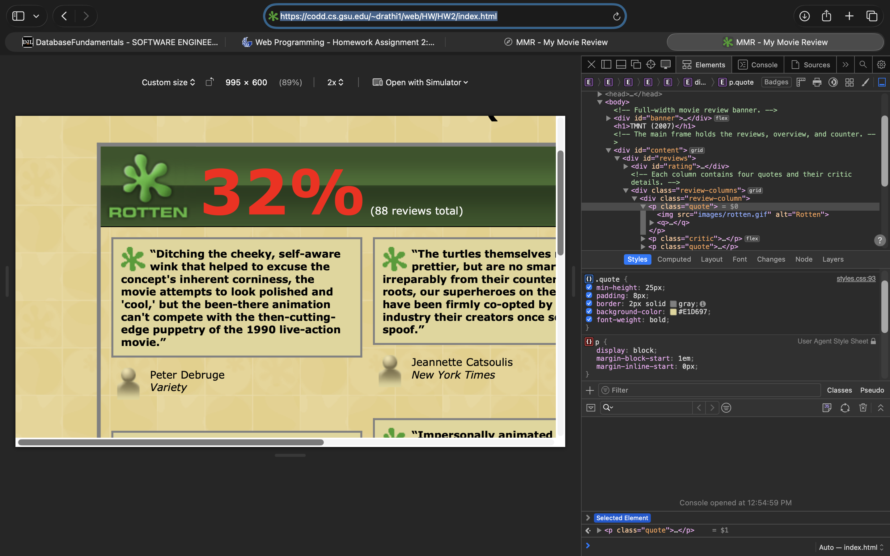
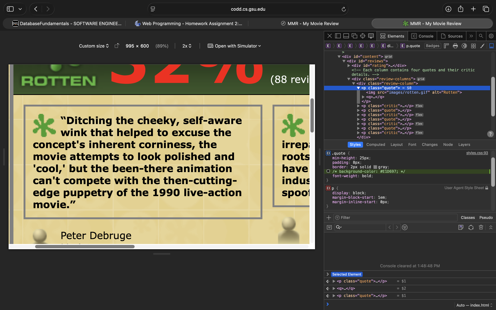
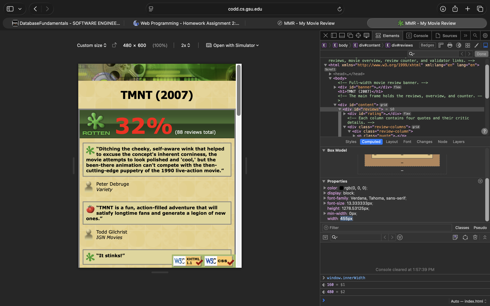
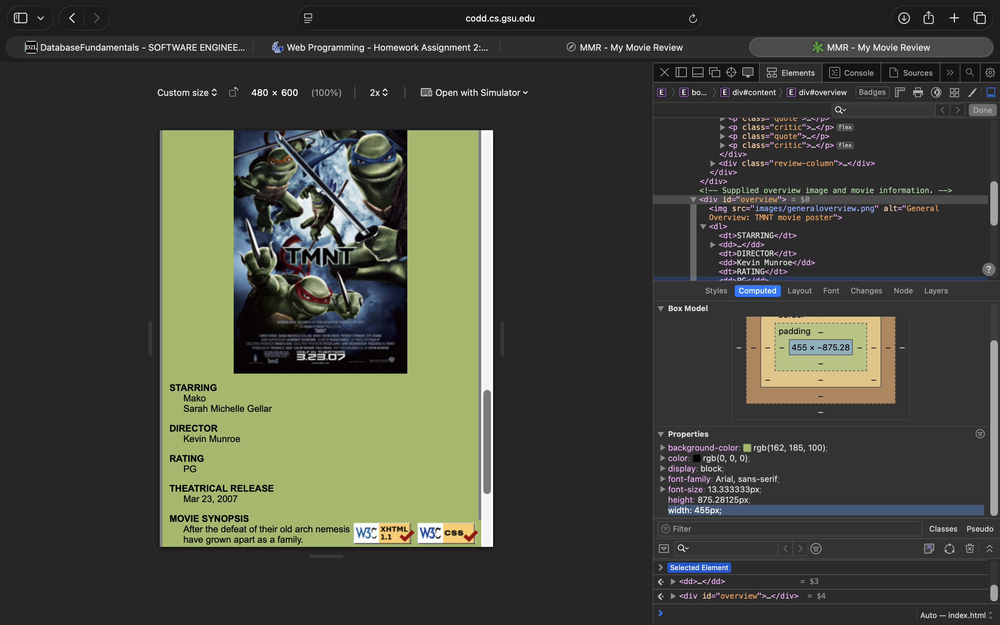
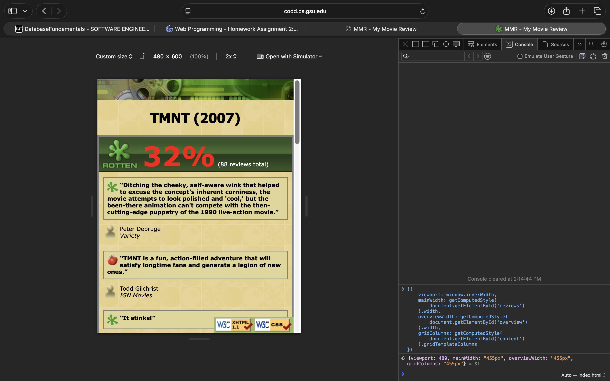
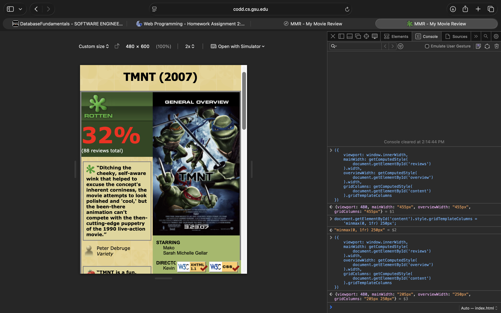

# Homework 2 — Critical Thinking Answers

**Name:** Darsh Rathi  
**Browser:** Safari  
**Submitted page:** https://codd.cs.gsu.edu/~drathi1/web/HW/HW2/index.html

## Question 1: Cascade investigation

My review boxes use the shared `.quote` rule below. Before the experiment, their background color was `#E1D697`. I selected the first `p.quote` in Safari's Web Inspector and unchecked its `background-color` declaration. Since that declaration belongs to a shared class rule, disabling it affected all eight review boxes. I used the first box for the before-and-after comparison.

```css
.quote {
    min-height: 25px;
    padding: 8px;
    border: 2px solid gray;
    background-color: #E1D697;
    font-weight: bold;
}
```

**Figure 1 — Safari responsive viewport setting: 995px wide. Before disabling the declaration, the first review box has a solid pale yellow background.**



**Figure 2 — Safari responsive viewport setting: 995px wide. After disabling the declaration, the page's tiled background is visible through the review box. Its border and bold text remain.**



The box's computed background color became `rgba(0, 0, 0, 0)`, meaning fully transparent. The console check below confirmed this when Safari's Computed panel omitted the property:

```js
getComputedStyle(document.querySelector('.quote')).backgroundColor
// "rgba(0, 0, 0, 0)"
```

**Figure 3 — Supplemental console result from the 995px responsive setting: the selected review's computed background color is transparent.**


No other declaration gives the review box a background color, so it uses the initial transparent value. The exact rule painting the visible pattern behind it is the `body` rule in `styles.css`:

```css
body {
    margin: 0;
    padding: 0;
    background-image: url("images/background.png");
    font-family: Verdana, Tahoma, sans-serif;
    font-size: 8pt;
}
```

The selector `.quote` has specificity `(0, 1, 0)`, while `body` has specificity `(0, 0, 1)`. However, these rules target different elements, so they do not compete for the review box's background color. The box does not inherit the body's background image; its transparency lets that image show through. Source order breaks ties between otherwise equally ranked declarations targeting the same element. Here, there is no competing declaration for the box's background color, and the disabled declaration is excluded from the cascade. The submitted stylesheet retains `background-color: #E1D697;`.

## Question 2: Responsive trade-off

At an actual viewport width of **480px**, Safari's Computed panel reported a width of **455px** for both the main review region (`#reviews`) and the sidebar (`#overview`). These are the element widths measured in my browser, rather than the width of the poster image. The console also confirmed `window.innerWidth` was `480`.

**Figure 4 — 480px viewport: the Computed panel shows `#reviews` at 455px wide.**



**Figure 5 — 480px viewport: the Computed panel shows `#overview` at 455px wide.**



My deliberate trade-off is to stack the overview below the reviews at widths of 700px or less. This makes the page longer vertically, but gives both regions the available content width. The container's maximum width accounts for its two 4px borders, and the single flexible track allows it to fit a narrow viewport.

```css
#content {
    display: grid;
    grid-template-columns: minmax(0, 1fr) 250px;
    width: 800px;
    max-width: calc(100% - 8px);
    margin: 0 auto;
    border: 4px solid gray;
}

#reviews {
    min-width: 0;
}

@media (max-width: 700px) {
    /* Other mobile declarations omitted from this excerpt. */
    #content {
        grid-template-columns: minmax(0, 1fr);
    }
}
```

I changed one layout value temporarily: `grid-template-columns` on `#content`. In Safari's console, I replaced the single track with a flexible review track and a 250px overview track:

```js
document.getElementById('content').style.gridTemplateColumns =
    'minmax(0, 1fr) 250px';
```

The viewport stayed at 480px. The main review region narrowed to **205px**, and the overview became **250px** wide. The first review wrapped into many more lines, and the rating icon, percentage, and review count split across multiple lines. This trial demonstrates a readability cost; I am not claiming it produced horizontal overflow.

| Layout at 480px | Main review width | Overview width | Computed grid tracks |
| --- | --- | --- | --- |
| Final stacked layout | 455px | 455px | `455px` |
| Temporary two-column layout | 205px | 250px | `205px 250px` |

**Figure 6 — 480px viewport: final stacked layout, with the console confirming both regions are 455px wide.**



**Figure 7 — 480px viewport: temporary two-column layout, with the console confirming review and overview widths of 205px and 250px.**



My final single-track value, `minmax(0, 1fr)`, is better at this width because it gives the reviews 250px more horizontal space and keeps the rating together. The overview remains available below the reviews. I accept the extra vertical scrolling to preserve readable text and avoid forcing the desktop layout into a phone-sized viewport. The submitted CSS uses this single-track value in the mobile media query.

## Live explanation preparation — not part of the written answers

For a roughly two-minute explanation of Question 2:

1. Open the submitted page in Safari at 480px. Show that `window.innerWidth` is `480`.
2. Select `#reviews` and `#overview` in the Computed panel and explain the measured widths. Point to the single-track media query in `styles.css`.
3. Explain the trade-off: the overview moves below the reviews, increasing vertical scrolling while preserving readable content width.
4. Apply the temporary two-column value above. Show the narrower reviews and the rating wrapping, then compare the measured widths with the saved screenshots.
5. Remove the temporary override and show the final layout again:

```js
document.getElementById('content').style.removeProperty('grid-template-columns');
```

Before submission, refresh the page to clear any remaining Inspector changes. Copy Questions 1 and 2, their code excerpts, figures, and captions into the submission document; keep this preparation section as personal notes.
